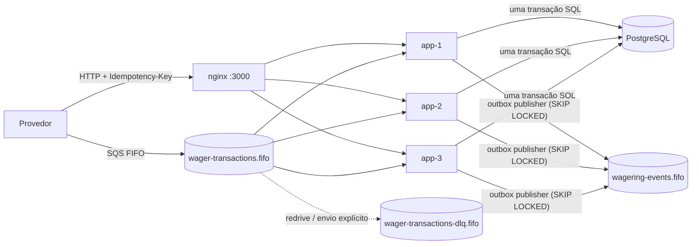

# Arquitetura

Este documento registra as decisões técnicas, os trade-offs e as limitações conhecidas. A regra que guiou tudo: **as garantias financeiras moram no banco**. Código de aplicação, broker e caches são otimização e ergonomia; o PostgreSQL é quem recusa estados inválidos.

## 1. Visão geral



Cada instância roda tudo: API HTTP, consumidor SQS, publisher da outbox e worker de referências pendentes. Não há eleição de líder: a correção sob concorrência vem do banco (lock de linha por wallet, chaves únicas, `FOR UPDATE SKIP LOCKED`).

Camadas (hexagonal, verificadas por `test/unit/architecture.test.ts` e por regra do Biome):

| Camada | Conteúdo | Pode depender de |
|---|---|---|
| `*/domain` | `Money`, `Wallet`, `WalletLedgerEntry`, `WagerTransaction`, `InboxMessage`, `OutboxMessage`, erros, portas de repositório | só `shared/domain` (e `decimal.js`, apenas em `money.ts`) |
| `*/application` | use cases, `WagerProcessor`, eventos de integração, hash canônico, portas (`UnitOfWork`, `Clock`, `IdGenerator`, logger, métricas) | domínio |
| `*/infrastructure` | MikroORM (schemas, mappers, repositórios, unit of work), SQS (consumer, publisher), pino, prom-client, config | tudo acima |
| `*/presentation` | controllers NestJS, contratos zod, filtro de exceções, interceptor de correlação, guard de auth | tudo acima |

`src/composition.ts` monta os use cases sem framework; o módulo NestJS só o embrulha. Os testes de integração usam o mesmo composition root.

### Fluxo de uma transação

Tudo abaixo acontece em **uma** transação SQL (`READ COMMITTED`), dentro de `em.transactional()`:

1. (somente SQS) `INSERT … ON CONFLICT DO NOTHING` na inbox por `(consumer_name, message_id)`. Se já existia e está processada, é redelivery: devolve o resultado original e não faz mais nada.
2. `SELECT … FOR UPDATE` na wallet — **a unidade de concorrência**.
3. Busca por transação existente com a mesma `idempotency_key` ou o mesmo `(provider_id, external_transaction_id)`. Existe: replay (mesmo hash) ou conflito (hash diferente).
4. Avalia as regras (seção 4) **em memória**: muda o estado do agregado `WagerTransaction` e da `Wallet`; nada foi escrito ainda.
5. `INSERT … ON CONFLICT DO NOTHING` da transação já no estado final. Se não inseriu (outra requisição com a mesma chave, em outra wallet, ganhou a corrida), resolve como replay ou conflito — nada mais foi escrito.
6. Lançamento no ledger + `UPDATE wallets … WHERE id = ? AND version = ?` (0 linhas ⇒ `WalletConcurrencyError`).
7. Eventos na outbox. Antecipa o retry de transações que aguardavam esta como referência.
8. Marca a inbox como processada. `COMMIT`. Só então a API responde ou o consumidor apaga a mensagem.

O caminho HTTP tem um *fast path* antes do passo 2: se a requisição já foi decidida, responde da leitura sem pegar lock.

## 2. ORM e mapeamento de `Money`

**MikroORM 6**, como data mapper e gerenciador de transação. As entidades de persistência são `EntitySchema` (sem decorators) e ficam separadas do domínio; mappers convertem registro ⇄ agregado via `rehydrate`.

Usos deliberados: `em.fork().transactional()` para a unit of work, `LockMode.PESSIMISTIC_WRITE` (`FOR UPDATE`) na wallet, `LockMode.PESSIMISTIC_PARTIAL_WRITE` (`FOR UPDATE SKIP LOCKED`) para outbox e worker de referências, `nativeUpdate` com condição de versão, migrator com `up`/`down`.

**O Identity Map é desligado nas leituras (`disableIdentityMap`) e as escritas são operações nativas explícitas.** Em um caminho quente, concorrente e financeiro, prefiro ver exatamente qual SQL roda e quando: o `UPDATE` condicionado à versão é a guarda otimista, e um flush implícito poderia esconder isso. O custo é perder o *change tracking* automático — aceitável, porque cada agregado tem poucas transições, todas explícitas.

`Money` ocupa duas colunas: `numeric(20,2)` (valor) e `char(3)` (moeda). O driver devolve `numeric` como **string**; o mapper reconstrói com `Money.from` e grava com `toJSON().amount`. Em nenhum ponto o valor passa por `number`. Dentro do domínio a aritmética é `decimal.js`, encapsulada em `Money` — nenhum outro arquivo importa `decimal.js`.

`Money.from` aceita valores negativos porque valores internos podem ser negativos (a `difference` da reconciliação). A recusa de negativos, zero e mais de 2 casas é responsabilidade dos **contratos de entrada** (zod na API e na fila) e das factories de domínio (`Wallet.open`, `WalletLedgerEntry.create`, `wallet.debit/credit`).

## 3. Concorrência

**Estratégia: lock pessimista por wallet + versão como guarda + constraints como última barreira.**

- `SELECT … FOR UPDATE` na linha da wallet serializa tudo o que toca aquela wallet, em qualquer instância. Wallets diferentes não disputam nada (o teste `3b` prova: com a wallet A travada por fora, a wallet B processa normalmente enquanto A espera).
- O `UPDATE` da wallet é `WHERE id = ? AND version = ?`. Com o lock isso nunca deveria falhar; se falhar (bug, alguém escrevendo sem lock), vira `WalletConcurrencyError`, que é transitório e é re-tentado com limite.
- `CHECK (balance >= 0)` e o trigger de acoplamento saldo ↔ ledger garantem que, mesmo com bug na aplicação, o banco não aceita saldo negativo nem saldo sem lançamento.

Por que não lock global: serializaria todas as wallets (eliminatório, restrição 6). Por que não otimista puro: numa wallet quente (ex.: duas apostas de 80 com saldo 100, ou 100 apostas simultâneas), retries otimistas geram tempestade de conflitos e latência imprevisível; o lock de linha transforma contenção em fila ordenada. O otimista entra como verificação barata.

**Deadlocks:** a ordem de aquisição é a mesma em todos os caminhos — **wallet → linhas de transação daquela wallet**. Por isso a antecipação de transações pendentes (`expediteWaitingOn`) é restrita à mesma wallet, e o worker de referências trava a wallet antes da transação. Mesmo assim, `40P01`, `55P03` (lock timeout) e `40001` são classificados como transitórios e re-tentados (até 3 vezes dentro do processo; depois 503 na API ou backoff de visibilidade no SQS).

**`lock_timeout`** (padrão 5 s) é configurado por sessão quando o pool cria a conexão: uma wallet quente demais vira erro re-tentável em vez de espera indefinida.

Recursos do broker (FIFO, `MessageGroupId = walletId`, deduplicação) são otimizações. O consumidor processa em sequência as mensagens de um mesmo grupo dentro de um lote e grupos diferentes em paralelo, mas a correção não depende disso.

## 4. Regras de negócio e interpretações

| Operação | Saldo | Ledger | Referência |
|---|---|---|---|
| `BET` | débito | 1 `DEBIT` | não pode ter |
| `WIN` | crédito | 1 `CREDIT` | opcional; se houver, precisa ser uma `BET` válida |
| `LOSS` | nenhum | nenhum | opcional (`BET`) |
| `REFUND` | crédito | 1 `CREDIT` | obrigatória, só `BET` |
| `ROLLBACK` | inverso do lançamento da referência | 1 invertido | obrigatória: `BET`, `WIN` ou `REFUND` |

A referência é resolvida por `(providerId, referenceExternalTransactionId)` e precisa ser do mesmo provider, player, wallet, moeda e rodada (`REFERENCE_MISMATCH`), ter o tipo permitido (`REFERENCE_KIND_NOT_ALLOWED`), estar `PROCESSED` (`REFERENCE_NOT_PROCESSED`) e ter o mesmo valor (`AMOUNT_MISMATCH`). Uma referência ainda em voo (`PENDING`/`PENDING_REFERENCE`) é tratada como ausente.

Interpretações adotadas:

- **Uma referência é revertida no máximo uma vez, por qualquer tipo de reversão.** O enunciado fala em "o mesmo tipo de operação"; permitir `REFUND` e depois `ROLLBACK` da mesma `BET` creditaria a aposta duas vezes. Fui mais restritivo: índice único parcial `uq_wt_reversal_once (reference_transaction_id) WHERE kind IN ('REFUND','ROLLBACK') AND status = 'PROCESSED'`. Reverter a reversão continua possível (`ROLLBACK` de um `REFUND` referencia o `REFUND`, não a `BET`).
- **`version` da abertura é 1.** O saldo inicial é o estado inicial, não uma mudança (o exemplo do enunciado devolve `version: 1` com saldo 1000). A transação `OPENING` e o lançamento `CREDIT` (versão 1 do ledger) são criados na mesma transação SQL; a primeira movimentação leva a versão a 2.
- **Saldo no replay:** cada transação guarda `observed_balance`, o saldo da wallet no momento da decisão (após o efeito, para `PROCESSED`; o saldo vigente, para `REJECTED`/`LOSS`/`PENDING_REFERENCE`). O replay devolve exatamente esse valor (regra 7).
- **Rejeição devolve `422`** (com `transactionId`, `failureCode` e saldo), e não `200`: o provedor decide pelo status sem ler mensagem. A transação é persistida e consultável. O replay de uma rejeição devolve `422` de novo, com `idempotentReplay: true`.
- **Wallet inexistente, wallet de outro jogador e moeda diferente são rejeições de negócio persistidas** (`WALLET_NOT_FOUND`, `WALLET_PLAYER_MISMATCH`, `CURRENCY_MISMATCH`). Por isso `wager_transactions.wallet_id` não tem FK para `wallets`: a tentativa contra uma wallet inexistente precisa ficar auditável. O ledger tem FK composta `(wallet_id, currency) → wallets(id, currency)`.
- **A mesma `(providerId, externalTransactionId)` com outra `Idempotency-Key` é conflito (`409`)**, mesmo com payload idêntico: a chave é a fonte da verdade, e um provedor que troca a chave para o mesmo id externo tem um bug que vale sinalizar.
- **`Money` zero em transações é inválido** (`400`); zero é aceito como saldo inicial.
- **Moeda:** o modelo é multi-moeda (uma wallet por jogador por moeda), os fluxos usam `BRL` e os conflitos de moeda são testados.

### Máquina de estados de `WagerTransaction`

| De | Para |
|---|---|
| `PENDING` | `PROCESSED`, `REJECTED`, `FAILED`, `PENDING_REFERENCE` |
| `PENDING_REFERENCE` | `PROCESSED`, `REJECTED`, `FAILED` |
| `PROCESSED`, `REJECTED`, `FAILED` | — (terminais) |

Transição inválida lança `InvalidTransactionStateError` (erro de programação → `500`, nunca `4xx`). `PENDING` existe só em memória: a linha é inserida já no estado final da decisão, então nunca há uma transação "meio aplicada" no banco. `rehydrate` não revalida transições.

### Códigos de falha

| Código | Quando | O que o provedor deve fazer | HTTP |
|---|---|---|---|
| `INVALID_PAYLOAD` | contrato inválido (zod, `Money`, header ausente) | corrigir e reenviar | 400 |
| `REFERENCE_REQUIRED` | `REFUND`/`ROLLBACK` sem referência | corrigir | 400 |
| `KIND_NOT_ALLOWED` | `OPENING` ou referência num tipo que não admite | corrigir | 400 |
| `IDEMPOTENCY_PAYLOAD_MISMATCH` | chave reutilizada com outro payload | nunca reenviar com essa chave | 409 |
| `INSUFFICIENT_BALANCE` | aposta maior que o saldo | não reenviar | 422 |
| `REVERSAL_WOULD_OVERDRAW` | `ROLLBACK` de crédito já gasto | investigar; não reenviar | 422 |
| `REFERENCE_NOT_FOUND` | referência não chegou dentro do limite | enviar a referência e depois uma nova reversão | 422 (via evento/consulta) |
| `REFERENCE_KIND_NOT_ALLOWED` | tipo de referência inválido | corrigir | 422 |
| `REFERENCE_NOT_PROCESSED` | referência rejeitada ou falha | não reenviar | 422 |
| `REFERENCE_MISMATCH` | referência de outro provider/player/wallet/moeda/rodada | corrigir | 422 |
| `REFERENCE_ALREADY_REVERSED` | referência já revertida | não reenviar | 422 |
| `AMOUNT_MISMATCH` | valor da reversão ≠ valor da referência | corrigir | 422 |
| `CURRENCY_MISMATCH` | moeda ≠ moeda da wallet | corrigir | 422 |
| `WALLET_NOT_FOUND` / `WALLET_PLAYER_MISMATCH` | wallet inexistente / de outro jogador | corrigir | 422 |
| `INFRASTRUCTURE_FAILURE` | mensagem esgotou as tentativas por falha de infraestrutura (status `FAILED`) | contatar suporte | — (DLQ) |

Falhas transitórias não têm `failureCode` de negócio: na API são `503` com `Retry-After` (reenviar a mesma requisição é seguro); na fila viram backoff de visibilidade.

## 5. Schema: as garantias no banco

Todas na migration `Migration20260101000000_initial` (reversível) e provadas com SQL cru em `test/integration/schema-constraints.test.ts`:

| Garantia | Mecanismo |
|---|---|
| Uma wallet por `(player, moeda)` | `UNIQUE (player_id, currency)` |
| Saldo nunca negativo | `CHECK (balance >= 0)` em `wallets` e no ledger |
| Toda mudança de saldo tem exatamente um lançamento (e vice-versa) | **constraint trigger diferida** `trg_wallet_ledger_coupling`: no `COMMIT`, uma mudança de saldo precisa ter `version = old + 1` e um lançamento com `wallet_version = version`, `balance_before = old.balance`, `balance_after = new.balance`; `version` não muda sem saldo mudar; uma wallet criada com saldo precisa do lançamento de abertura |
| Ledger sem buracos nem duplicatas | `UNIQUE (wallet_id, wallet_version)` + `UNIQUE (transaction_id)` |
| Aritmética do lançamento | `CHECK` `balance_after = balance_before ± amount`, `amount > 0` |
| Ledger imutável | triggers que bloqueiam `UPDATE`, `DELETE` e `TRUNCATE`; wallets não podem ser apagadas |
| Moeda do lançamento = moeda da wallet | FK composta `(wallet_id, currency) → wallets(id, currency)` |
| Idempotência | `UNIQUE (idempotency_key)`, `UNIQUE (provider_id, external_transaction_id)` |
| Reversão única | índice único parcial `uq_wt_reversal_once` |
| Coerência de status | `CHECK`s: terminal ⇔ `processed_at`; `REJECTED`/`FAILED` ⇔ `failure_code`; `PENDING_REFERENCE` ⇔ agendamento; `REFUND`/`ROLLBACK` ⇒ referência |
| Dedup de inbox | `PRIMARY KEY (consumer_name, message_id)` |

Índices de suporte: cursor do ledger `(wallet_id, id)`, parciais para `PENDING_REFERENCE` e para a outbox pendente.

## 6. Idempotência

- **Fonte da verdade:** o header `Idempotency-Key` (na fila, `data.idempotencyKey`). Persistido com `UNIQUE`. Não existe cache em memória.
- **`payloadHash`** = SHA-256 (hex minúsculo) do JSON canônico — chaves ordenadas recursivamente, sem espaços, campos `undefined` omitidos — do subconjunto `providerId, externalTransactionId, playerId, walletId, roundId, gameId, kind, money, referenceExternalTransactionId`, com `money` normalizado antes (`"25.0"` e `"25.00"` geram o mesmo hash). Headers e metadados de transporte (`messageId`, `occurredAt`) não entram. Exemplo:

  ```
  {"externalTransactionId":"transaction-123","gameId":"fortune-chimp","kind":"BET","money":{"amount":"25.00","currency":"BRL"},"playerId":"0192f28f-…","providerId":"provider-a","roundId":"round-987","walletId":"0192f291-…"}
  ```

- **Replay vs conflito:** mesma chave + mesmo hash → resultado original (`idempotentReplay: true`); qualquer diferença → `409`, nunca replay.
- **Corridas:** duas requisições iguais em instâncias diferentes serializam no lock da wallet e a segunda vê a primeira na re-verificação sob lock. Se as wallets forem diferentes (payload divergente com a mesma chave), o `INSERT … ON CONFLICT DO NOTHING` espera a outra transação terminar e a resolução vira conflito. O teste de concorrência 1 envia a mesma `BET` 50 vezes em paralelo por 3 instâncias: 1 débito, 49 replays.
- **Por que inbox separada da chave de idempotência:** a inbox deduplica a *mensagem* (`messageId`, por consumidor), a chave deduplica a *operação de negócio*. Uma redelivery do SQS é detectada antes de qualquer trabalho, e duas mensagens diferentes com a mesma operação continuam caindo na idempotência de negócio.

## 7. Referências fora de ordem

Uma reversão cuja referência ainda não existe é gravada como `PENDING_REFERENCE` (resposta `202`, evento `WagerTransactionPendingReference`). O worker (`PollingLoop` a cada `PENDING_REF_POLL_MS`, padrão 5 s, em todas as instâncias) busca as vencidas com `FOR UPDATE SKIP LOCKED`, trava a wallet e reavalia.

- **Backoff exponencial por transação:** 1 s, 2 s, 4 s… até 60 s.
- **Limite:** 10 tentativas **ou** 15 minutos desde a criação, o que vier primeiro. Ao esgotar: `REJECTED` com `REFERENCE_NOT_FOUND` + `WagerTransactionRejected`.
- **Justificativa:** na prática, a `BET` chega segundos antes ou depois da reversão; 15 minutos cobrem uma indisponibilidade curta do lado do provedor sem manter estado pendente indefinidamente, e 10 tentativas com teto de 60 s somam ~6 minutos de tentativas ativas.
- **Atalho:** quando a referência é processada, as transações da mesma wallet que esperavam por ela têm o próximo retry antecipado para "agora", então o caso comum resolve em milissegundos, não no próximo ciclo de backoff.

## 8. Transactional outbox

Os eventos são gravados em `outbox_messages` na mesma transação da mudança financeira (o teste de atomicidade injeta uma falha na escrita da outbox e verifica que wallet, ledger, transação e inbox não mudaram).

O publisher (um por instância) faz, em transação: `SELECT … WHERE published_at IS NULL AND next_attempt_at <= now() ORDER BY next_attempt_at, occurred_at LIMIT 50 FOR UPDATE SKIP LOCKED`, envia em lotes de 10 (`SendMessageBatch`) para `wagering-events.fifo` com `MessageGroupId = aggregateId` e `MessageDeduplicationId = eventId`, marca publicadas ou agenda retry (backoff 1 s → 5 min, com jitter) e faz commit.

- **Vários publishers:** `SKIP LOCKED` garante que dois publishers nunca pegam a mesma linha (teste: 3 publishers concorrentes, cada evento enviado exatamente uma vez).
- **Morte depois do commit e antes de publicar:** a linha fica pendente e qualquer instância a publica (teste de concorrência 5: a instância que fez o commit tem a outbox desligada e morre; outra publica).
- **Morte depois de publicar e antes de marcar:** o evento é enviado de novo — *at-least-once*. O `eventId` é o id da linha da outbox, igual em todas as tentativas; consumidores deduplicam por ele (a deduplicação do FIFO, de 5 minutos, ajuda mas não é a garantia).
- **Ordem:** o FIFO preserva a ordem por `aggregateId` dentro de um publisher, mas publishers concorrentes podem intercalar eventos de um mesmo agregado. Consumidores devem ordenar `WalletBalanceChanged` por `walletVersion`, que está no payload para isso.

Eventos (classe abstrata `IntegrationEvent<T>`, uma subclasse por evento, `eventType` e `version` no tipo, `data` só com `MoneyProps`): `WagerTransactionProcessed` (inclusive `LOSS`), `WagerTransactionRejected`, `WalletBalanceChanged` (só quando o saldo muda; também na abertura com saldo) e `WagerTransactionPendingReference`.

## 9. Consumidor SQS

Loop próprio de long polling (sem biblioteca, para controlar ack e visibilidade). Para cada mensagem: valida o contrato com zod, abre o contexto de log e chama **o mesmo** `ProcessWagerTransactionUseCase` da API, com `inbox = { consumerName, messageId }`.

| Resultado | Classificação | Ação |
|---|---|---|
| `PROCESSED`, `REJECTED`, `PENDING_REFERENCE`, replay, conflito de idempotência | negócio, terminal | `DeleteMessage` (ack) — sempre depois do commit |
| contrato inválido, `type` desconhecido, `OPENING`, `Money` inválido | permanente | envia para a DLQ com `failureReason` e apaga da origem (sem gastar 5 ciclos) |
| `TransientInfrastructureError` (banco fora, deadlock, lock timeout) e erros inesperados | transitório | `ChangeMessageVisibility` com backoff `min(2^receiveCount, 300)` s |
| transitório na tentativa `SQS_MAX_RECEIVE_COUNT` | esgotado | grava a transação como `FAILED` (`INFRASTRUCTURE_FAILURE`, auditável, sem tocar saldo) e envia para a DLQ |

A fila principal também tem `RedrivePolicy` para a DLQ como rede de segurança.

**SIGTERM:** para de receber (aborta o long poll), espera as mensagens em andamento até `SHUTDOWN_TIMEOUT_MS` (padrão 25 s; o `stop_grace_period` do compose é 30 s) e devolve as que não terminaram com visibilidade 0. Depois para outbox e worker, fecha o pool e o HTTP. Os testes cobrem os dois caminhos (drenagem e devolução) e o crash entre commit e ack (`FAULT_CRASH_AFTER_COMMIT`, ponto de injeção que só é aceito com `NODE_ENV=test`).

`FAILED` é terminal: um reenvio da mesma operação devolve `FAILED` como replay. Isso torna a falha auditável e impede que uma operação abandonada seja aplicada horas depois sem ninguém perceber; o custo é que o reprocessamento exige intervenção (redrive manual da DLQ com nova chave). Trade-off consciente.

## 10. API HTTP

| Situação | HTTP | Corpo |
|---|---|---|
| Processada / `LOSS` / replay | 200 | `{ transactionId, status, balance, idempotentReplay }` |
| Pendente de referência | 202 | idem, `status: PENDING_REFERENCE` |
| Rejeição de negócio | 422 | idem + `failureCode` |
| Payload inválido | 400 | `{ error: INVALID_PAYLOAD, failureCode, details }` |
| Conflito de idempotência | 409 | `{ error: IDEMPOTENCY_PAYLOAD_MISMATCH, transactionId }` |
| Wallet duplicada | 409 | `{ error: WALLET_ALREADY_EXISTS }` |
| Não encontrado | 404 | `{ error: NOT_FOUND }` |
| Falha transitória | 503 + `Retry-After: 1` | `{ error: TRANSIENT_FAILURE, retryable: true }` |
| Erro de programação | 500 | `{ error: INTERNAL_ERROR, correlationId }` |

O mapeamento é único (`DomainExceptionFilter`) e vale para todos os endpoints. Todas as respostas de erro trazem `correlationId`. O cursor do ledger é o id (UUID v7, ordenado no tempo) do último item, em base64url: estável sob inserções concorrentes e opaco para o cliente.

## 11. Autenticação

**Decisão: não implementada.** Não pontua e competiria com correção, concorrência e idempotência. O ponto de extensão está explícito no código:

- `NoopAuthGuard` registrado como `APP_GUARD` global — trocar por um guard JWT.
- `ProviderIdentityPort` com `UnverifiedProviderIdentityAdapter`, que hoje devolve o `providerId` do payload com `verified: false`. O controller já passa por essa porta antes do use case.

Desenho que eu adotaria: **Keycloak** no compose, um *client* por provedor com *client credentials*; o provedor obtém um token e envia `Authorization: Bearer`. O guard valida assinatura via JWKS (com cache e rotação de chaves), `iss`, `exp` e `aud = wagering-api`. O adapter lê a claim `provider_id` do token e o use case rejeita payloads cujo `providerId` seja diferente (`403`). Health e métricas continuam abertos; a fila segue como canal interno confiável, mas o `providerId` da mensagem continua passando pelas mesmas validações de domínio (referência do mesmo provider etc.).

## 12. Observabilidade

- **Logs** JSON (pino) com `instanceId`, `correlationId`, `requestId`, `messageId`, `transactionId`, `walletId`, `providerId` propagados por `AsyncLocalStorage`. Chaves que poderiam carregar dinheiro ou payloads (`money`, `amount`, `balance*`, `payload`, `body`, `data`) são **removidas** de toda linha de log por configuração do pino, independentemente de quem loga. O teste de API verifica que nenhum log contém valor monetário.
- **Métricas** (`/metrics`, prom-client): `wager_transactions_total{kind,status,channel}`, `transaction_processing_duration_seconds`, `idempotent_replays_total`, `idempotency_conflicts_total`, `inbox_duplicates_total`, `wallet_lock_conflicts_total{reason}`, `transient_retries_total`, `sqs_messages_{received,acked,retried,dlq}_total`, `pending_reference_retries_total`, `pending_reference_exhausted_total`, `outbox_published_total`, `outbox_publish_failures_total`, `outbox_pending`, `outbox_oldest_pending_age_seconds`, `outbox_lag_seconds`, `wallet_reconciliation_divergences_total`, além das métricas padrão do processo.
- **Health:** `/health/live` (processo) e `/health/ready` (`SELECT 1` + `GetQueueAttributes`, com timeout de 2 s; `503` se algo cair).
- **Reconciliação:** sob lock da wallet, compara saldo materializado com a soma do ledger; divergência é logada, contada e devolvida com `consistent: false` — nunca corrigida.

## 13. Desvios em relação ao plano inicial (`CLAUDE.md`)

| Plano | O que foi feito | Motivo |
|---|---|---|
| `@mikro-orm/nestjs`, `nestjs-pino`, `@nestjs/schedule` | composition root próprio, pino direto, `PollingLoop` próprio | menos mágica; controle explícito do ciclo de vida e do shutdown dos workers |
| Migrations pela CLI do MikroORM | `scripts/migrate.ts` com `migrationsList` | a CLI depende de descoberta de arquivos TS; a lista explícita funciona igual no Bun, no Docker e nos testes |
| `scripts/init-sqs.sh` com `awslocal` | `scripts/init-sqs.ts` (AWS SDK) | roda na imagem da aplicação, funciona com LocalStack, MiniStack ou SQS real, e é reutilizado pelos testes |
| URLs das filas na configuração | resolvidas por nome (`GetQueueUrl`) quando ausentes | o formato de URL muda entre versões do LocalStack |
| `balance_after` | `observed_balance` | também vale para rejeições e pendências (é o saldo observado na decisão) |
| FK `wager_transactions.wallet_id → wallets` | sem FK | rejeição por wallet inexistente precisa ser persistida |
| `uq_wt_reversal_once (reference_transaction_id, kind)` | `(reference_transaction_id)` | impede `REFUND` + `ROLLBACK` da mesma `BET` (crédito duplo) |
| Teste com `docker pause` do Postgres | proxy TCP derrubado e religado no meio do teste | queda de rede real, sem depender do Docker dentro dos testes |
| — | `wallet_version` no ledger + trigger diferida | leva a garantia "todo saldo tem lançamento" para o schema |

## 14. Limitações e próximos passos

- **Ledger de partidas simples.** Partidas dobradas (contas de casa/jogador) seriam o próximo passo para auditoria contábil.
- **Reversão parcial** fora de escopo (o valor precisa ser igual ao da referência).
- **Wallets muito quentes** serializam no lock da linha; a vazão por wallet é limitada pela latência de uma transação (~10–15 ms aqui). Mitigações possíveis: sub-contas/particionamento do saldo, ou fila por wallet com processamento em lote.
- **Publisher da outbox** compete por CPU com a API (ver `docs/load-test-results.md`); em produção iria para um processo dedicado, com `LISTEN/NOTIFY` em vez de polling e publicação paralela por grupo.
- **Retenção:** inbox e outbox publicadas crescem sem limite; faltam jobs de expurgo (ex.: apagar inbox processada há mais de N dias, depois da janela de redelivery).
- **Sem OpenTelemetry/dashboards** (opcionais). Os campos de correlação e as métricas já existem para isso.
- **Ambiente de validação:** a suíte rodou contra PostgreSQL 16 real e um emulador SQS compatível (moto) porque o Docker Hub não estava acessível no ambiente de desenvolvimento; o compose usa LocalStack. A imagem Docker e o compose foram validados sintaticamente, mas não construídos nesse ambiente.
